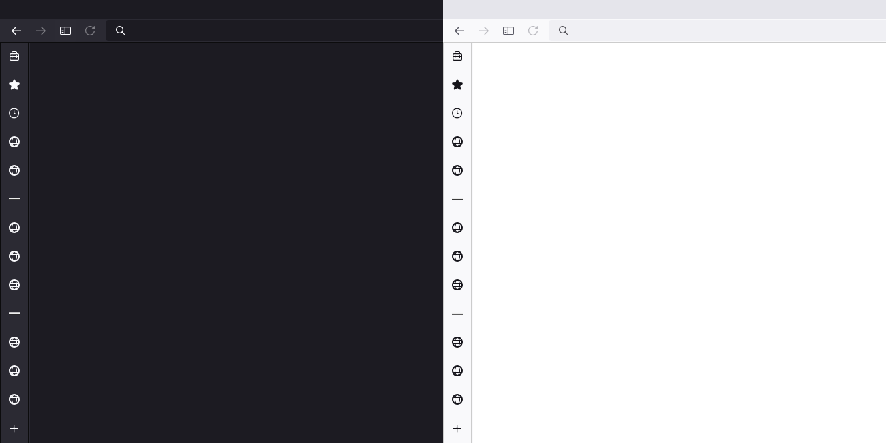
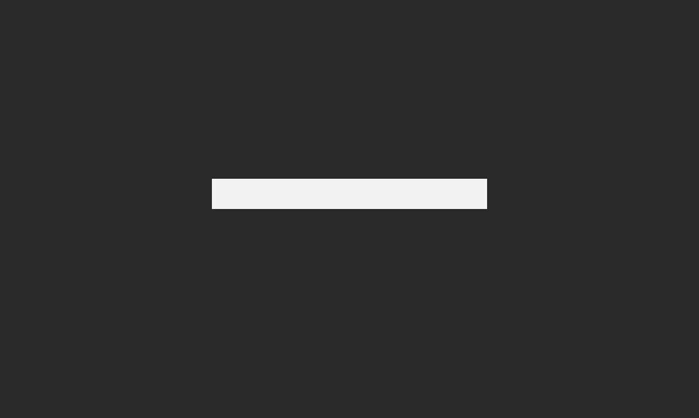
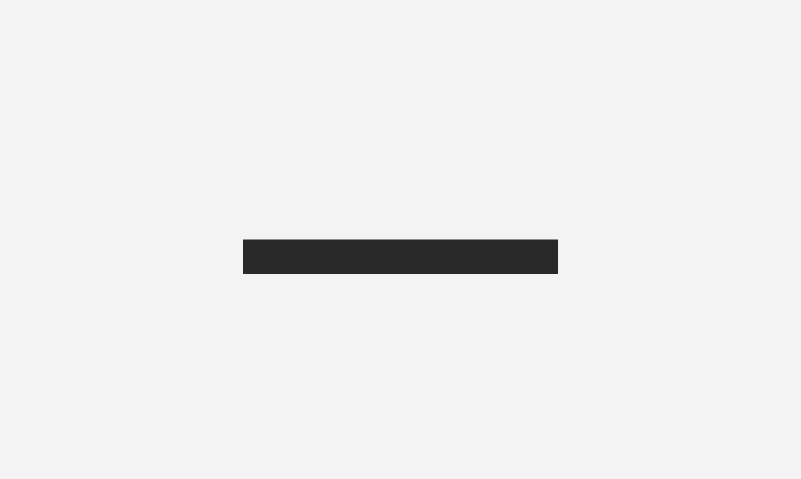

# Web Panel Divider

A favicon divider to separate Web Panel icons in Floorp's sidebar. It works perfectly with light and dark themes due to its binary nature.

---

## "Installation"

1. Save [this page](https://enigmabyte8.github.io/web-panel-divider/) as Web Panel to your sidebar.

  

2. Place it where you want to separate your Web Panels.

---

## Mode

### Dark

### Light

---

Forked from [LukeHarambasic's bookmark divider repo](https://github.com/LukaHarambasic/bookmark-divider).
